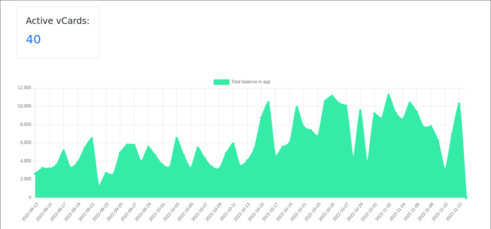

# vCard
This website allows users to create virtual banking accounts for sending money to others.

## Main features
* Creating virtual cards (vCards) associated to phone numbers;
* Transfer "money" (simulated) between vCards or to other payment services (simulated);


* Create categories and assign transactions to categories;
* Access statistics like balance and number of transactions throughout time;




## How to run

- Backend server: run sail
(requires docker and sudo if docker requires sudo)
```bash
cd vcardlaravel
cp .env.example .env
composer install

# if these commands output "Docker is not running." try with sudo.
./vendor/bin/sail up -d
./vendor/bin/sail artisan migrate
./vendor/bin/sail artisan db:seed
./vendor/bin/sail artisan passport:install
./vendor/bin/sail artisan storage:link
./vendor/bin/sail artisan passport:client --password
# copy client id and client secret to the .env file (overriding what's present)
```

- Vue: (requires nodejs)
```bash
cd vcardvue
cp .env.example .env
npm install
npm run serve
```
- Websocket server: (requires nodejs)
```bash
cd vcardws
cp .env.example .env
npm install
node index.js
```
